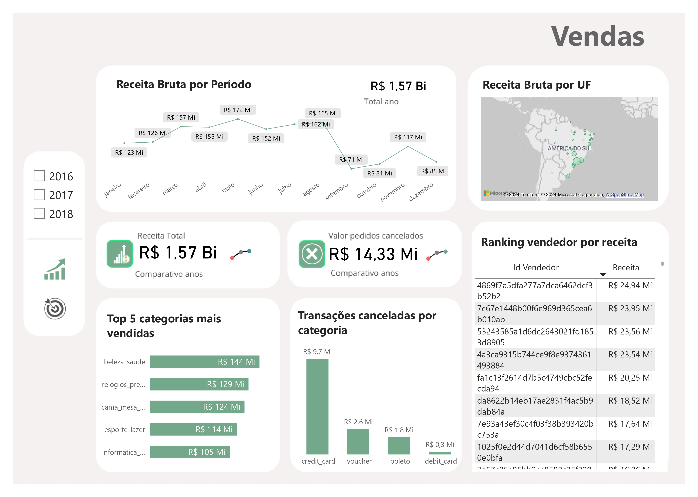
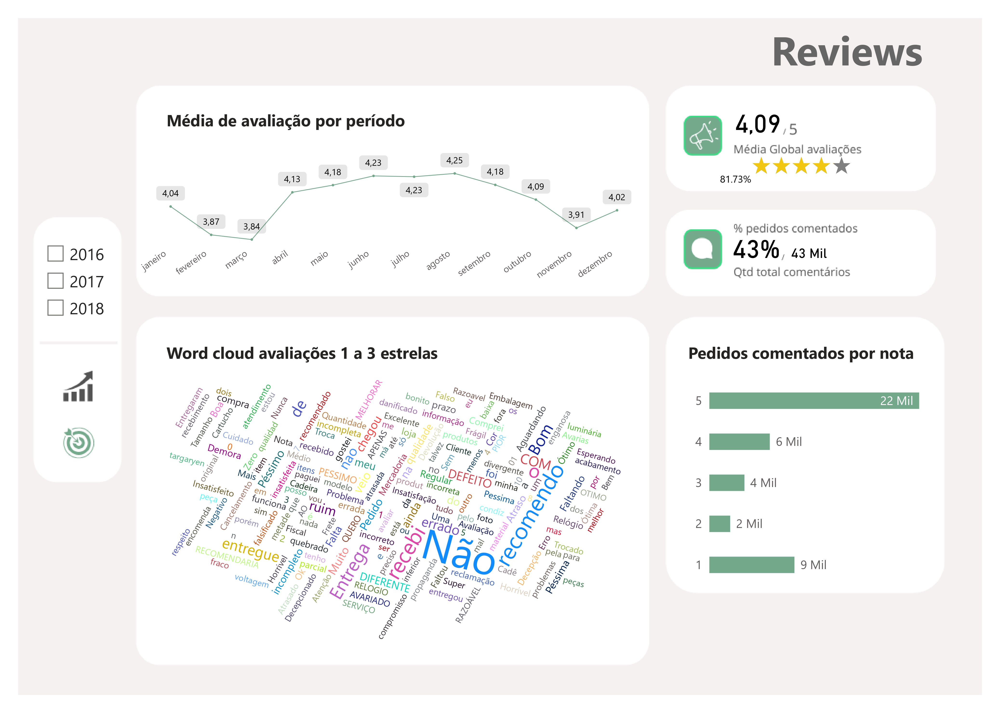

# Dashboard-E-commerce-Brasileiro-no-Power-BI

### Overview do Projeto 

Este projeto visa promover insights detalhados sobre a performance de vendas e produtos de uma empresa brasileira de e-commerce, com dados de setembro de 2016 a 2018. A análise abrange múltiplos aspectos das operações de vendas, incluindo:

- Receita bruta total no período
- Distribuição de vendas por unidade federativa (UF)
- Categorias de produtos mais vendidas
- Valor total das vendas canceladas
- Ranking de vendas por vendedor

Além disso, examinamos a satisfação dos clientes, classificada de 1 a 5 estrelas, observando a frequência de comentários para cada nota e o total de feedbacks recebidos. Este projeto proporciona uma visão abrangente e prática para apoiar estratégias de marketing, operações e atendimento ao cliente, com insights para decisões baseadas em dados.

### Dataset

O conjunto de dados usado neste projeto está disponível publicamente no Kaggle:

https://www.kaggle.com/datasets/olistbr/brazilian-ecommerce

Talvez seja necessário criar uma conta do Kaggle para acessar esse conjunto de dados.

### Ferramentas

- Power Bi: Importação dos arquivos em CSV e visualização dos dashboards.
- Figma: Criação do design visual do indicador, permitindo uma apresentação mais clara dos insights obtidos na análise.

### Dados Utilizados

- dCliente: Registro dos clientes com informações sobre a cidade, ID, UF, e CEP
- dLocal: Localização onde as vendas ocorreram
- dProdutos: Lista todos os produtos que foram vendidos durante o período, segmentados por ID, categoria e cubagem
- dVendedor: Tabela dimensão com o cadastro de todos os vendedores, categorizados pelo ID, CEP e Estado
- fPagamentos: Tabela fato com todas as transações ocorridas, dado o tipo de pagamento (cartão de crédito, débito, boleto ou voucher
- fPedidos: Todos os pedidos dos clientes, segmentados pelo ID do pedido, o vendedor, o status do pedido, hora da compra, previsão de entrega, etc.
- fReviews: Mostra os reviews dos clientes ao longo do período, assim como a nota recebida pelo pedido, o título do review e o comentário.
- fVendas: Tabela fato que mostra o detalhamento dos produtos que foram feitos no pedido, incluindo o valor da mercadoria, a quantidade e o valor do frete. 

### Estrutura do dashboard
#### Aba Vendas
- Receita bruta por período: Exibe o gráfico de linhas de receita bruta ao longo do período
- Receita bruta por UF: Gráfico de mapa exibindo a receita bruta segmentada por Estado
- Receita Total: Cartão de receita total que mostra a receita de todo o período dos anos de 2016 a 2018. A sparkline ao lado mostra de forma simples e compacta a variação da receita bruta ao longo dos anos, onde o marcador em vermelho mostra o ano com a menor quantidade de vendas e a verde mostra a maior quantidade de vendas
- Top 5 categorias mais vendidas: Gráfico de barras clusterizado exibindo o top 5 das categorias mais vendidas ao longo dos anos
- Valor dos pedidos cancelados: Cartão com valor monetário do cancelamento dos clientes. A sparkline ao lado mostra de forma simples e compacta a variação do valor de cancelamento dos pedidos ao longo do período, onde o marcador em vermelho mostra o ano com a menor valor de cancelamento e a verde mostra o maior valor de cancelamentos
- Transações canceladas por categoria: Valor monetário em reais do total de cada pedido cancelado por categoria
- Ranking vendedor por receita: Mostra o ranking dos vendedores por valor de suas vendas

  
  
  

#### Aba Reviews
- Média de avaliação por período: Mostra a média da classificação de 1 a 5 dos pedidos durante os meses
- Word Cloud avaliações 1 a 3 estrelas:  Word cloud das avaliações das notas inferiores de 4 a 5
- Média global avaliações: Média total das avaliações e o aproveitamento em porcentagem
- % Pedidos comentados: Quantidade em porcentagem dos comentários em relação ao total de reviews
- Pedidos comentados por nota: Quantidade de reviews por cada avaliação dada

  
  
  

### Diagrama ER 
