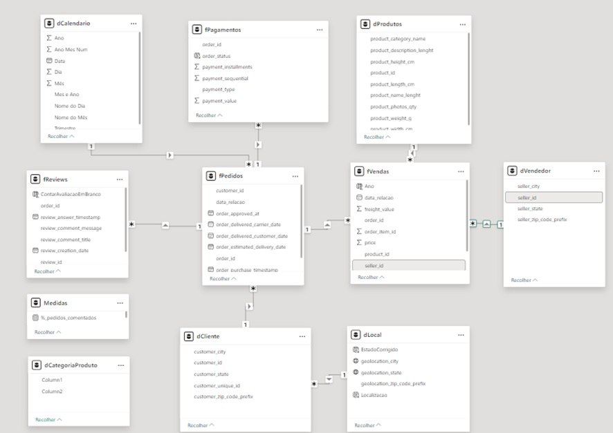

# Dashboard-E-commerce-Brasileiro-no-Power-BI

### Overview do Projeto 

Este projeto visa promover insights detalhados sobre a performance de vendas e produtos de uma empresa brasileira de e-commerce, com dados de setembro de 2016 a 2018. A análise abrange múltiplos aspectos das operações de vendas, incluindo:

- Receita bruta total no período.
- Distribuição de vendas por unidade federativa (UF).
- Categorias de produtos mais vendidas.
- Valor total das vendas canceladas.
- Ranking de vendas por vendedor.

Além disso, examinamos a satisfação dos clientes, classificada de 1 a 5 estrelas, observando a frequência de comentários para cada nota e o total de feedbacks recebidos. Este projeto proporciona uma visão abrangente e prática para apoiar estratégias de marketing, operações e atendimento ao cliente, com insights para decisões baseadas em dados.
  
### Dataset

O conjunto de dados usado neste projeto está disponível publicamente no Kaggle:

https://www.kaggle.com/datasets/olistbr/brazilian-ecommerce

Talvez seja necessário criar uma conta do Kaggle para acessar esse conjunto de dados.

<div align="center">
  


</div>

### Ferramentas

- Power Bi: Importação dos arquivos em CSV e visualização dos dashboards.
- Figma: Criação do design visual do indicador, permitindo uma apresentação mais clara dos insights obtidos na análise.

### Dados Utilizados

- dCliente: Registro dos clientes com informações sobre a cidade, ID, UF, e CEP.
- dLocal: Localização onde as vendas ocorreram.
- dProdutos: Lista todos os produtos que foram vendidos durante o período, segmentados por ID, categoria e cubagem.
- dVendedor: Tabela dimensão com o cadastro de todos os vendedores, categorizados pelo ID, CEP e Estado.
- fPagamentos: Tabela fato com todas as transações ocorridas, dado o tipo de pagamento (cartão de crédito, débito, boleto ou voucher.
- fPedidos: Todos os pedidos dos clientes, segmentados pelo ID do pedido, o vendedor, o status do pedido, hora da compra, previsão de entrega, etc.
- fReviews: Mostra os reviews dos clientes ao longo do período, assim como a nota recebida pelo pedido, o título do review e o comentário.
- fVendas: Tabela fato que mostra o detalhamento dos produtos que foram feitos no pedido, incluindo o valor da mercadoria, a quantidade e o valor do frete. 

### Estrutura do dashboard
#### Aba Vendas
- Receita bruta por período: Exibe o gráfico de linhas de receita bruta ao longo do período.
- Receita bruta por UF: Gráfico de mapa exibindo a receita bruta segmentada por Estado.
- Receita Total: Cartão de receita total que mostra a receita de todo o período dos anos de 2016 a 2018. A sparkline ao lado mostra de forma simples e compacta a variação da receita bruta ao longo dos anos, onde o marcador em vermelho mostra o ano com a menor quantidade de vendas e a verde mostra a maior quantidade de vendas.
- Top 5 categorias mais vendidas: Gráfico de barras clusterizado exibindo o top 5 das categorias mais vendidas ao longo dos anos.
- Valor dos pedidos cancelados: Cartão com valor monetário do cancelamento dos clientes. A sparkline ao lado mostra de forma simples e compacta a variação do valor de cancelamento dos pedidos ao longo do período, onde o marcador em vermelho mostra o ano com a menor valor de cancelamento e a verde mostra o maior valor de cancelamentos.
- Transações canceladas por categoria: Valor monetário em reais do total de cada pedido cancelado por categoria.
- Ranking vendedor por receita: Mostra o ranking dos vendedores por valor de suas vendas.

<div align="center">
  
  
  
</div>

#### Aba Reviews
- Média de avaliação por período: Mostra a média da classificação de 1 a 5 dos pedidos durante os meses.
- Word Cloud avaliações 1 a 3 estrelas:  Word cloud das avaliações das notas inferiores de 4 a 5.
- Média global avaliações: Média total das avaliações e o aproveitamento em porcentagem.
- % Pedidos comentados: Quantidade em porcentagem dos comentários em relação ao total de reviews.
- Pedidos comentados por nota: Quantidade de reviews por cada avaliação dada.

<div align="center">
  
  
  
</div>

### Diagrama ER 

<div align="center">



</div>

### Tratamento dos dados

Na tabela fPagamentos, existiam 3 linhas na “payment_type” como “not defined”. Para o tratamento, desmarcaremos a opção para que esses valores nulos não apareçam quando o gráfico for plotado. 

#### Criação da tabela dCalendário
Foi criada a tabela dCalendario que abrange o intervalo desde o primeiro dia do ano do primeiro registro de venda, até o último dia do ano da última data de registro de venda. Sendo ele: 

```
M

let
    /*  CRIANDO AS VARIAVEIS */
    Tabela = List.Buffer(fVendas[shipping_limit_date]),
    MinDate = List.Min(Tabela),
    MaxDate = List.Max(Tabela),
    MaxYear = Date.Year(MaxDate),
    MinYear = Date.Year(MinDate),
    InitialDate = #date(MinYear,1,1 ),
    EndDate = #date( MaxYear,12,31),
    Duration = Duration.Days( EndDate - InitialDate ) + 1,
    Fonte = List.Dates(InitialDate, Duration, #duration(1, 0, 0, 0)),

    #"Convertido para Tabela" = Table.FromList(Fonte, Splitter.SplitByNothing(), null, null, ExtraValues.Error),
    #"Colunas Renomeadas" = Table.RenameColumns(#"Convertido para Tabela", {{"Column1", "Data"}}),
    #"Tipo Alterado" = Table.TransformColumnTypes(#"Colunas Renomeadas", {{"Data", type date}}),
    #"Ano Inserido" = Table.AddColumn(#"Tipo Alterado", "Ano", each Date.Year([Data]), Int64.Type),
    #"Nome do Mês Inserido" = Table.AddColumn(#"Ano Inserido", "Nome do Mês", each Date.MonthName([Data]), type text),
    #"Mês Inserido" = Table.AddColumn(#"Nome do Mês Inserido", "Mês", each Date.Month([Data]), Int64.Type),
    #"Dia Inserido" = Table.AddColumn(#"Mês Inserido", "Dia", each Date.Day([Data]), Int64.Type),
    #"Nome do Dia Inserido" = Table.AddColumn(#"Dia Inserido", "Nome do Dia", each Date.DayOfWeekName([Data]), type text),
    #"Trimestre Inserido" = Table.AddColumn(#"Nome do Dia Inserido", "Trimestre", each Date.QuarterOfYear([Data]), Int64.Type),
    #"Prefixo Adicionado" = Table.TransformColumns(#"Trimestre Inserido", {{"Trimestre", each "T" & Text.From(_, "pt-BR"), type text}}),
    #"Coluna Personalizada Adicionada" = Table.AddColumn(#"Prefixo Adicionado", "Mes e Ano", each Text.Combine({Text.Start(Text.Proper([Nome do Mês]), 3), " ", Text.From([Ano], "pt-BR")}), type text),
    #"Coluna Personalizada Adicionada1" = Table.AddColumn(#"Coluna Personalizada Adicionada", "Ano Mes Num", each Text.Combine({Text.From([Ano], "pt-BR"), Text.PadStart(Text.From([Mês], "pt-BR"), 2, "0")}), type text),
    #"Tipo Alterado1" = Table.TransformColumnTypes(#"Coluna Personalizada Adicionada1", {{"Ano Mes Num", Int64.Type}}),
    // Filtrando apenas os anos 2016 a 2018
    #"Filtrado Anos" = Table.SelectRows(#"Tipo Alterado1", each [Ano] >= 2016 and [Ano] <= 2018)

in
    #"Filtrado Anos"
```
### Análise Exploratória dos dados 
A EDA envolveu a exploração dos dados de vendas para responder perguntas-chave, como:
1.	Qual a receita bruta dos meses ao longo dos anos? Qual ano teve a maior receita? Qual mês teve a maior receita?
2.	Qual a receita bruta por cada UF? Qual Estado Teve a maior receita?
3.	Qual a receita bruta total de 2016 até 2018?
4.	Qual receita bruta das 5 categorias mais vendidas?
5.	Qual o valor total da taxa de cancelamento?
6.	Qual meio de pagamento houve maior taxa de cancelamento?
7.	Qual a receita por vendedor?
Também houve EDA para a exploração dos dados dos Reviews para responder perguntas-chave, como:
1.	Qual a média de avaliação dos meses do longo dos anos?
2.	Dos feedbacks negativos, quais foram os principais problemas encontrados?
3.	Qual a média global das avaliações do período?
4.	Qual a porcentagem e a quantidade de pedidos
   
### Análise dos dados

Exemplo de coluna calculada utilizada no projeto: 

```
DAX

title_or_comment_is_blank = --retorna se pelo menos a coluna "review_comment_title" ou "review_comment_message" foi preenchida para contar a quantidade de comentários
SWITCH(
    TRUE(),
    fReviews[review_comment_title] <> "", 1,
    fReviews[review_comment_message] <> "", 1,
    0
)
```
Algumas medidas utilizadas no projeto
```
DAX

receita_de_pedidos_aprovados = 

 var pagamentos_aprovados = CALCULATE(
    SUM(fVendas[price]),  
    fPedidos[order_status] IN {"approved", "delivered", "invoiced", "shipped"} -- apenas os status válidos
)
var pagamentos_fretes_aprovados = CALCULATE(
    SUM(fVendas[freight_value]),  
    fPedidos[order_status] IN {"approved", "delivered", "invoiced", "shipped"} -- apenas os status válidos
)

return pagamentos_aprovados + pagamentos_fretes_aprovados -- soma do frete com a venda realizada 
```
```
DAX

valor_pedidos_cancelados = 
CALCULATE(
    SUM(fPagamentos[payment_value]),  
    fPedidos[order_status] IN {"canceled"} -- apenas os status cancelados
)

```
```
DAX 

%_pedidos_comentados = 
var pedidos_com_comentarios = CALCULATE(
    COUNTROWS(
        fReviews),
        fReviews[title_or_comment_is_blank] = 1 -- linhas que tiveram comentários no título, no corpo do texto de comentário ou os dois
)

var pedidos_totais = 
    COUNTROWS(
        fReviews
    )
    return pedidos_com_comentarios / pedidos_totais
```
```
DAX

pedidos_com_avaliacao_de_1_2_e_3 = 
CALCULATE(
    COUNT(
        fReviews[review_score]),
        fReviews[review_score] IN {1, 2, 3}
)
media_de_avaliacoes = AVERAGE(
    fReviews[review_score]
)
```

### Resultados
Os resultados da análise são resumidos da seguinte forma: 

#### Vendas
1.	O mês com a maior quantidade de vendas foi em novembro de 2017. Em novembro ocorre a Black Friday, logo, os clientes aproveitam o mês para consumir uma quantidade maior de produtos.
2.	No top 5, podemos notar que beleza e saúde dominou o top 1 dentro de todo período. Das possíveis causas podem ser citadas é a influência das mídias sociais e influenciadores digitais, que promovem esses produtos e reforçam tendências. Pode ser citado também a conscientização sobre autocuidado e bem estar, que incentiva o consumo desses produtos.
3.	Das transações que foram canceladas, o cartão de crédito é a que teve o maior valor monetário em cancelamentos. Dentre as razões podemos citar o limite insuficiente, problemas com verificação de segurança, a compra por impulso ou arrependimento ou até mesmo suspeita de fraude por conta das empresas, é comum as compras serem canceladas para proteger tanto o cliente com o varejista.
4.	Os Estados que tiveram a maior quantidade de vendas foram os que possuem a maior densidade populacional. Como por exemplo São Paulo, Rio de Janeiro e Minas Gerais. 
#### Reviews
1.	Os clientes tiveram uma tendência de comentarem quando a nota é 5. Isso pode ocorrer porque, quando há satisfação deles com o produto possuem mais motivação para comentar sua experiência positiva. Quando têm uma experiência negativa, podem levar a achar que o problema não será resolvido ou não querem investir seu tempo com um feedback.
2.	Podemos notar também que os clientes que tiveram experiências extremas (que deram notas muito boas ou muito ruins) foram mais propensos a deixar avaliações, que pode ser visto na quantidade de feedbacks para as notas 1 e 5.
3.	A nota 4,09 indica que a experiência agrada a maioria dos clientes, mas não alcança um nível excelente. Ainda podem existir oportunidades de melhoria. Esta nota sugere que há avaliações extremas, tanto a nota 5 como 1 ou 2.
4.	A word cloud das notas que vão de 1 até 3 mostra padrões nos feedback dos clientes em relação aos produtos, podemos notar que alguns produtos chegaram avariados, vieram diferentes do pedido, com defeitos, falsificados e alguns foram enviados de forma incompletas.

### Recomendações
Baseado na análise, recomendamos seguir as seguintes ações:
- Como produtos de beleza e saúde possuem frequência de recompra, oferecer campanhas que combinem itens populares com produtos complementares pode aumentar o ticket médio. Focar em campanhas nas redes sociais podem manter o engajamento dessa categoria. 
- Para as compras canceladas no cartão de crédito, uma hipótese é enviar uma notificação explicativa e amigável oferecendo ajuda imediata para a solução do problema, como outras formas de pagamento.  Por exemplo: “Notamos um problema com sua última compra. Deseja concluir com outro método de pagamento?”. Podemos também facilitar a recompra enviando um link direto para a recompra do item cancelado, com o carrinho já preenchido e outras opções de pagamento. 
- Para os estados que consumiram menos ao longo do período, criar campanhas sazonais e culturais. Alguns deles possuem características únicas que afetam o consumo. Explorar os períodos e tradições locais pode aumentar a receptividade às campanhas.
- É importante que o cliente compartilhe seu feedback, isso gera uma visão clara dos pontos de melhoria. Dessa forma, oferecer cupom de desconto ou brindes para motivar os clientes a compartilhas suas experiências. 
- Para as notas que foram baixas, criar um feedback de perguntas que são guiadas e personalizadas de forma objetiva, como por exemplo: “O que você gostaria que fosse diferente?” isso induz o cliente a deixar um feedback específico sobre o que são atendeu às expectativas.
- Após o cliente avaliar com uma nota baixa, agradecer o feedback e pedir detalhamento do que foi ocorrido. Esse contato incentiva mais clientes a detalharem seus problemas. 
- Incentivar também o feedback dos clientes neutros a comentarem podem oferecer uma visão mais equilibrada e detalhada sobre a experiência média.
### Limitações
A base de dados abrange o período de 2016 a 2018, com dados completos para todos os meses de 2017, enquanto os demais anos têm informações parciais.


